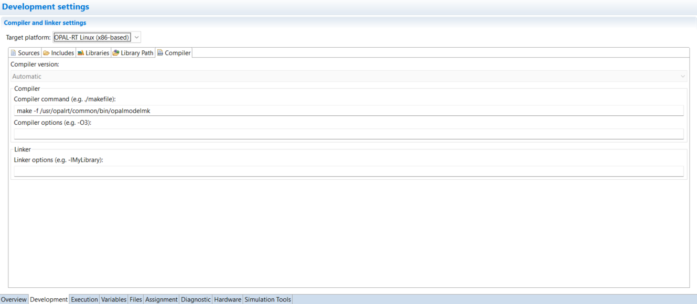
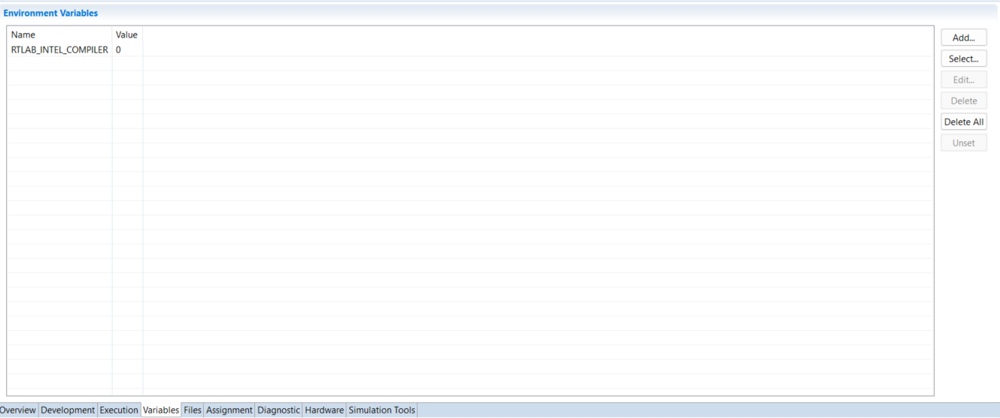
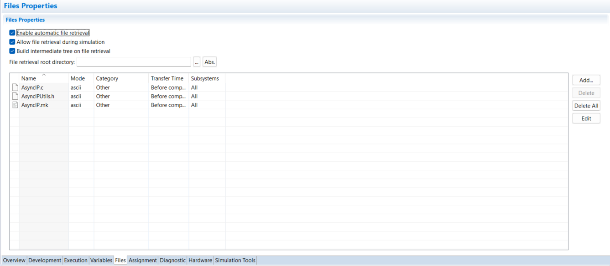
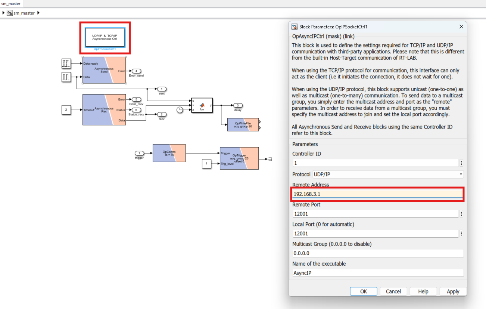
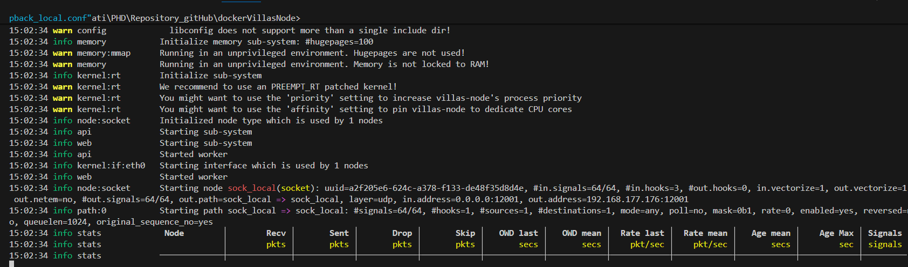
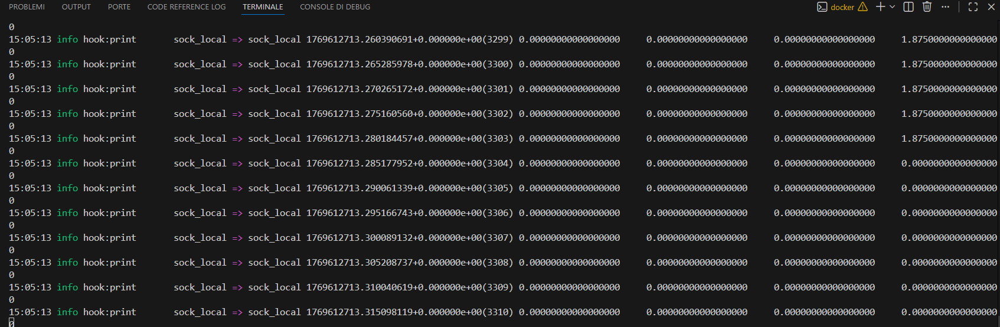
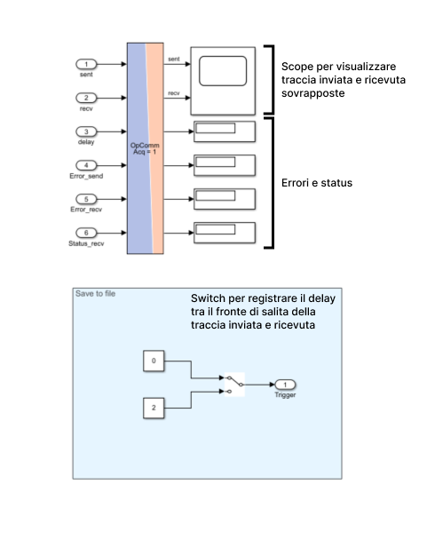

1. nella cartella dockerVillasNode creata per l'installazione del software villas node incollare il file "loopback_local.conf" contenente la seguente configurazione:

    ```json  
    nodes = {
        sock_local={
            type ="socket",
            layer="udp",
            format="raw",
            in = {
                # This node only received messages on this IP:Port pair
                address = "*:12001",
            },
            out = {
                # This node sends outgoing messages to this IP:Port pair
                address = "xxx.xxx.xxx.xxx:12001",
            }
        }
    }

    paths=(
        {
            in = "sock_local",
            out = "sock_local",
            hooks=(
                {
                    type="print",
                }
                

            )
        }
        
    )
    ```
    where "xxx.xxx.xxx.xxx" deve essere sostituito con l'indirizzo IP del simulatore.

2. Importare il progetto simulink contenuto nel file zip "loopback_simulink.zip" in RT-Lab, assicurarsi che vengano importati tutti i file contenuti nell'archivio:
```text
   loopback_simulink
   ├── loopback_model.slx
   ├── AsyncIP.c
   ├── AsyncIP.mk
   └── AsyncIPUtils.h 
 ```  
3. Inserire la seguente stringa nella tab Development/Compiler:
    ```text
    make -f /usr/opalrt/common/bin/opalmodelmk
    ```  
    come mostrato in figura



4. Nella tab variables se non presente per qualche ragione il compilatore sul sistema opal (si hanno errori riguardo al compiler GNU o gcc), impostare la variabile in figura (presente tra le predefinite premendo su "Add")
 

5. Nella tab files devono essere aggiunti i file precedentemente importati nella creazione del progetto come in figura seguente, assicurarsi che il transfer time sia impostato su "Before compilation":
 
 i file possono essere imèportati per mezzo del tasto "Add" selezionando i file presenti nella root folder del progetto.

    **ATTENZIONE**
    
    Talvolta premendo "Add" di default si viene portati nella cartella da cui si è importato il progetto e di conseguenza i file, assicurarsi di importare la copia dei file presenti nella root folder del progetto RT-Lab, presente nel workspaxe RT-Lab.


6. Editando il progetto è necessario impostare ip e porte di comunicazione, la 12001 preimpostata dovrebbe essere libera sul pc per cui l'esempio sarà presentato con tale impostazione. L'IP da impostare sarà invece quello del PC su cui viene eseguita l'istanza villas. Nell'esempio in figura sostituire l'indirizzo evidenziato con quello corretto per il proprio setup.



7. Salvare il progetto simulink e chiudere il file
8. Procedere con il Build su RT-Lab
9. Procedere con il load sul simulatore
10. Aprire un terminale powershell nella cartella dockerVillasNode ed eseguire il comando:
    ```text
    docker run -it --rm -p 12001:12001/udp -p 8000:8000 -v "${PWD}:/data" --entrypoint /bin/bash  villas-node -c "villas node loopback_local.conf"
    ``` 
    si dovrebbe restare in attesa del segnale da parte del simulatore come in figura: 


11. Eseguire la simulazione con RT-Lab con il pulsante "Execute", nel terminale villas dovrebbero iniziare a comparire i dati inviati dal e per il simulatore:  Per fermare il villas è sufficiente premere Ctrl+C


12. La console della simulazione riportata di seguito 
    Assicurarsi di avere eseguito villas prima di avviare la registrazione su file dei delay, altrimenti le misure verrebbero falsate.

13. Reset della simulazione tramite RT-Lab. Al termine della simulazione il file con le misure dei delay verrà salvato nella cartella root del progetto nel workspace RT-Lab in un percorso simile a:
    ```text
    loopback_simulink/loopback_simulink_sm_master/OpREDHAWKtarget/delays.mat
    ``` 
    E' possibile spostare il file "delays.mat" per aprirlo ed analizzarlo. Il file è composto da una tabella di sole due righe, nella prima il tempo della simulazione corrispondente al sample, nella sevonda rica sono riportati i sample dei delay misurati in secondi. Facendo la media/mediana/moda della seconda riga sulla sual lunghezza si ottiene la metrica per analizzare il ritardo sullo specifco percorso di rete.

    


   